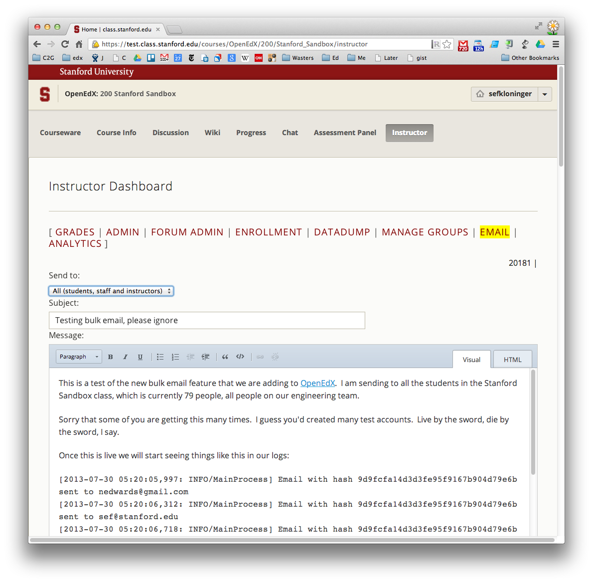
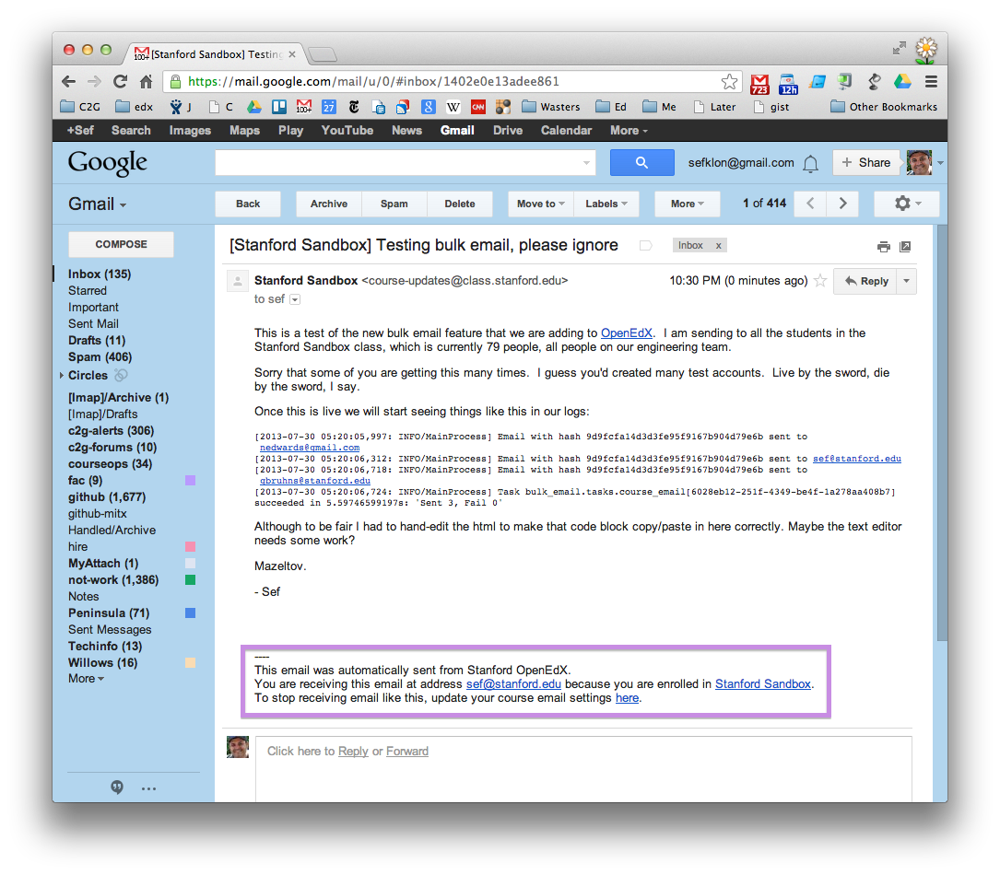
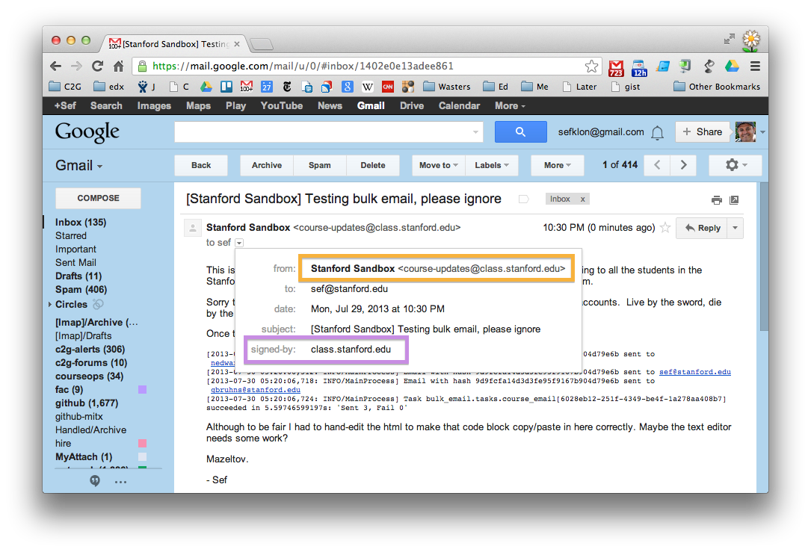
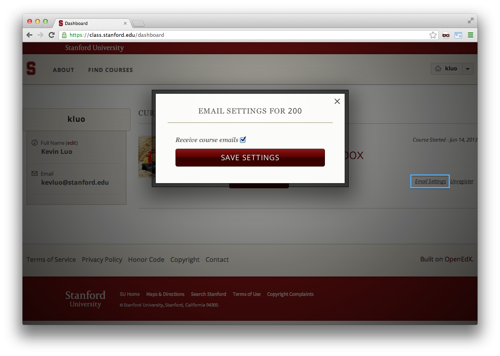

THIS IS A DRAFT DOCUMENT OF A FEATURE IN DEVELOPMENT. 
IT HASN'T BEEN PULLED INTO THE EDX-CORE YET.

## Overview

Course staff can now compose emails and send them to course staff.  The
key features are:

* Ability to compose HTML messages in the site.
 
* MIME multipart mails are sent
 
* Ability to efficiently to send to very large classes by fanning out
  jobs to worker machines over a job queue (celery).

* Mails are CAN-SPAM compliant: messages automatically have an optout link in the footer that directs them to the dashboard where users can set email settings for the course.

The detailed stories for the feature are [here](https://docs.google.com/document/d/1s1Jq1SId-aeDV1XlW3Qoq9L9R0-UTkrO6XLqiTa0nRU/edit). Marketing mail is still to be done.

Credit goes to Jason Bau (<jbau@stanford.edu>) for developing the
feature in Class2Go.  Students Kevin Luo (<kevluo@stanford.edu>) and Akshay
Jagadeesh (<akshayj@berkeley.edu>) took that code and ported to OpenEdX over Summer
2013.

## Known Issues

International Content - Unicode characters in the email subject and body is supported, but not in the recipient's name or the course title when included in the email footer. See [issue](https://github.com/Stanford-Online/edx-platform/issues/3).

## Feature Description

Instructors access the feature through the instructor dashboard by clicking the Email link.
This is toggled by the feature flag ENABLE_INSTRUCTOR_EMAIL.

## Backend

The djangoapp bulk_email handles the email-sending action by getting the recipient
list and batching the emails to different celery tasks to do the actual sending. The
number of emails each task sends is configurable with EMAILS_PER_TASK. It requires
the lynx package to convert HTML email to plaintext for multipart emails. SMTP errors
are handled appropriately by retrying or falling through to the next email. There are
several configurable settings with defaults. DEFAULT_BULK_FROM_EMAIL specifies the
from address for email. EMAIL_HOST, EMAIL_PORT, EMAIL_HOST_USER, EMAIL_HOST_PASSWORD,
and EMAIL_USE_TLS are for the SMTP email backend settings.

Any SMTP server may be specified for the email backend settings.
We use Amazon SES to send our mails.  We have SES configured to sign
messages on our behalf using DKIM to reduce the likelihood that they
will be treated by spam by the receiver.  Note the signature in the
following screenshot. See [here](http://docs.aws.amazon.com/ses/latest/DeveloperGuide/dkim.html) for more
information.

## Optouts

Users have the option to opt out of course specific emails in the user dashboard through an Email Settings link for each course. If they chose to do so, they will not receive emails sent by the instructor for the course.

