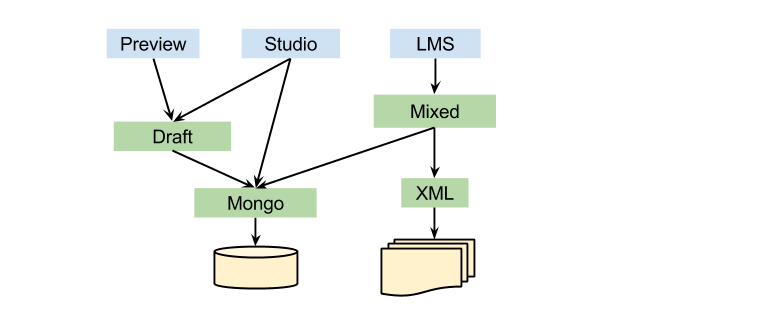

In preparation for enabling use of the [Split Modulestore](https://github.com/edx/edx-platform/wiki/Split%3A-the-versioning%2C-structure-saving-DAO), we have updated edx-platform so accesses to modulestores in LMS and Studio are now always directed through the `MixedModuleStore`.

The `MixedModuleStore` is a server-wide singleton with a pluggable API where one or more courseware persistence providers can be accessed through a single interface.  Higher layers can call the `MixedModuleStore` with `UsageKeys` or `CourseKeys` and know that their calls will be routed to the correct corresponding underlying store.  

Each server instance configures its `MixedModuleStore` with database access parameters and its preferred ordered list of providers.

## Summary of Changes
### Before
Prior to this work, Studio code had to be cognizant of the various Modulestores and explicitly request `Draft` or `Mongo` depending on the revision and category of the `xBlock` it was operating on.  The diagram below illustrates this.

Additionally, logic for traversing hierarchies when doing CRUD operations on xBlocks used to be done in higher layers (in Studio).  

Also, each server instance had duplicated configuraton settings for the various modulestores.   



### After


Now, all code goes through the common `MixedModuleStore` API, and there is a clearer distinction between modulestore-level logic (hierarchy traversal, handling revisions) and higher-level logic (handling `xBlock` exceptional cases such as for `StaticTab`s).

**Server Configuration Settings**
Since different servers may have differing default preferences for the revisions they require, we have 
introduced a new server configuration setting (`MODULESTORE_BRANCH`) for specifying this preference, with currently supported values being `draft-preferred` (set by Studio) and `published-only` (set by LMS and Preview).

Additionally, we have changed the data structure for `Options[stores]` in the `MixedModuleStore` setting from a `dict` to a `list`, so an _ordered_ list of store preferences can be specified.

***Overriding the Branch Setting via a contextmanager***
Callers to the modulestore may, at (rare) times, need to override the server's default branch setting for certain operations.  For such cases, we have introduced a `contextmanager` named `store_branch_setting` to temporarily override the default branch setting.

***Optional Revision Parameter***
In other cases, callers may need more detail control of the specific revisions of an xBlock that they want to access.  For such usage, we have provided an optional revision parameter in certain modulestore methods so the caller has more control of which revisions are queried. Currently, the following methods support a revision parameter: `has_item`, `get_item`, `get_items`, `get_parent_location`, and `delete_item`.

The branch and revision constants can be found in the `ModuleStoreEnum` class:

```
class ModuleStoreEnum(object):
    """
    A class to encapsulate common constants that are used with the various modulestores.
    """

    class Type(object):
        """
        The various types of modulestores provided
        """
        split = 'split'
        mongo = 'mongo'
        xml = 'xml'

    class RevisionOption(object):
        """
        Revision constants to use for Module Store operations
        Note: These values are passed into store APIs and only used at run time
        """
        # both DRAFT and PUBLISHED versions are queried, with preference to DRAFT versions
        draft_preferred = 'rev-opt-draft-preferred'

        # only DRAFT versions are queried and no PUBLISHED versions
        draft_only = 'rev-opt-draft-only'

        # # only PUBLISHED versions are queried and no DRAFT versions
        published_only = 'rev-opt-published-only'

        # all revisions are queried
        all = 'rev-opt-all'

    class Branch(object):
        """
        Branch constants to use for stores, such as Mongo, that have only 2 branches: DRAFT and PUBLISHED
        Note: These values are taken from server configuration settings, so should not be changed without alerting DevOps
        """
        draft_preferred = 'draft-preferred'
        published_only = 'published-only'

    class BranchName(object):
        """
        Branch constants to use for stores, such as Split, that have named branches
        """
        draft = 'draft-branch'
        published = 'published-branch'
```

**A Smarter Mongo**
As part of this effort, we have updated the Mongo (and Draft) modulestore implementation so it is smarter about which revisions to update and automatically traversing the hierarchy when appropriate.  In particular, the `publish`, `unpublish`, `delete_item`, and `convert_to_draft` methods automatically affect all nodes in the subtree.  The `delete_item` and `get_parent_location` methods are now smarter about determining which revision to operate on, by default.

All of these above changes will help us on our way to enabling the `SplitModulestore` (just a hop and a skip away).